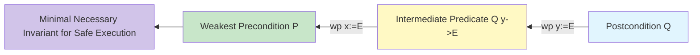

# GenPark Dijkstra Weakest Precondition Calculus Skill

Dijkstra's Weakest Precondition (wp) predicate transformer calculus engine backward-propagating postconditions.

Explore more at [GenPark](https://genpark.ai) and the [GenPark MCP Catalog](https://genpark.ai/mcp).

## Features
- Exact predicate transformation for sequential assignments and branches.
- Automatic verification condition generation.
- Pure Python standard library.
